# PRAKTIKUM 5 BELAJAR LIST 🤡

## LIST 🤖

### 1. Membuat List 👺

Membuat list dengan simbol list menggunakan [] seperti pada gambar <br/>
Contoh List <br/>
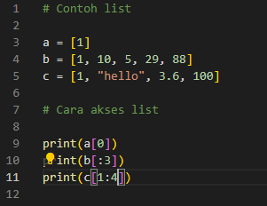 <br/>
Untuk penggunaan list dapat dengan memanggil langsung nama list yang sudah di buat atau memanggil nama list di ikuti dengan index ke berapa yang mau di panggil seperti pada gambar di atas <br/>
Dan ini adalah hasil dari progrma di atas <br/>
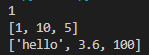 <br/>

### 2. Ubah Element List 👺

Mengubah Element pada list <br/>
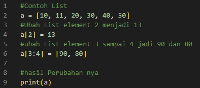 <br/>
Untuk hasil perubahannnya seperti ini <br/>
 <br/>

### 3. Penambahan Element List 👺

Append untuk menambahkan 1 item di akhir <br/>
Extend untuk menambahkan beberapa item di akhir <br/>
Seperti pada gambar di bawah <br/>
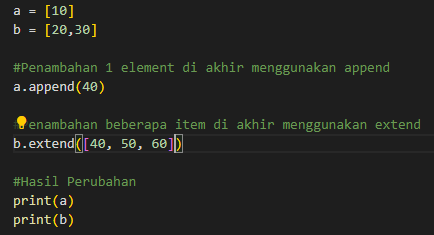 <br/>
Untuk hasil perubahannya seperti ini<br/>
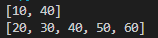 <br/>

### 4. Penggabungan List 👺

Penggabungan List dapat dilakukan dengan menggunakan Extend atau langsung dengan operator tambah seperti pada gambar di bawah <br/>
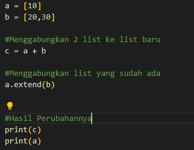 <br/>
Untuk hasil perubahannya seperti ini<br/>
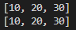 <br/>

## Latihan 1 👻

Latihan <br/>

• Buat sebuah list sebanyak 5 elemen dengan nilai bebas<br/>

- akses list:<br/>
  • tampilkan elemen ke 3 <br/>
  • ambil nilai elemen ke 2 sampai elemen ke 4 <br/>
  • ambil elemen terakhir <br/>
- ubah elemen list: <br/>
  • ubah elemen ke 4 dengan nilai lainnya <br/>
  • ubah elemen ke 4 sampai dengan elemen terakhir <br/>
- tambah elemen list: <br/>
  • ambil 2 bagian dari list pertama (A) dan jadikan list ke 2 (B) <br/>
  • tambah list B dengan nilai string <br/>
  • tambah list B dengan 3 nilai <br/>
  • gabungkan list B dengan list A <br/>

Berikut adalah Perogram nya
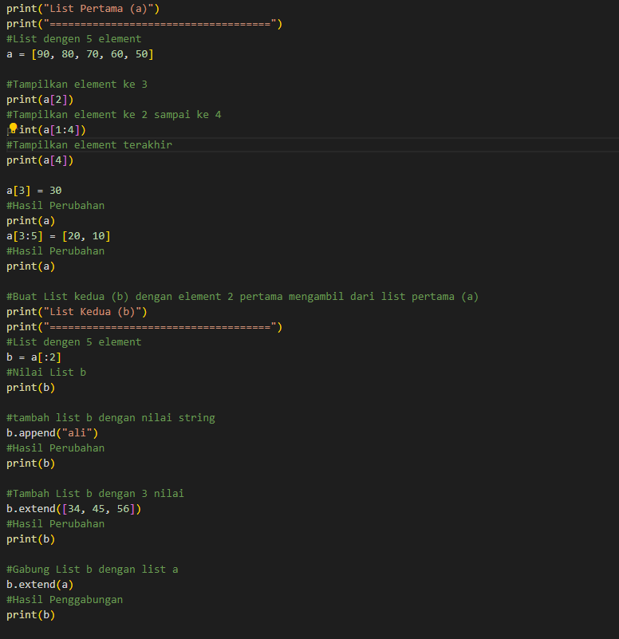 <br/>

Untuk hasil Perogram nya seperti ini <br/>
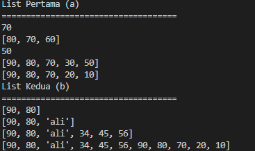 <br/>

## Praktikum 5 🧑‍🚀

### Deskripsi Program 👨‍💻

Buat program sederhana untuk menambahkan data kedalam sebuah<br/>

- list dengan rincian sebagai berikut:<br/>
  • Progam meminta memasukkan data sebanyak-banyaknya (gunakan perulangan) <br/>
  • Tampilkan pertanyaan untuk menambah data (y/t?), apabila jawaban t (Tidak), maka program akan
  menampilkan daftar datanya.<br/>
  • Nilai Akhir diambil dari perhitungan 3 komponen nilai (tugas: 30%, uts: 35%, uas: 35%)<br/>
  • Buat flowchart dan penjelasan programnya pada README.md.<br/>
  • Commit dan push repository ke github.<br/>

Berikut untuk Flowchart nya

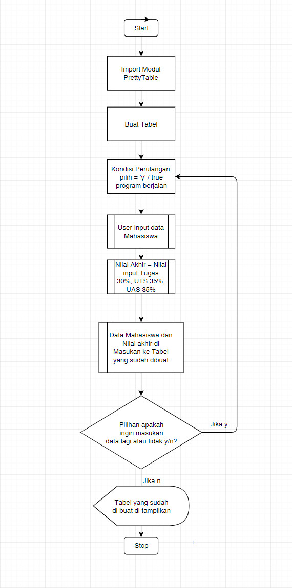

Untuk pembuatan tabel nya disini saya menggunakan PrettyTable yang sudah disediakan Python cara install nya cukup dengan perintah ```pip install PrettyTable``` pada cli dan untuk cara penggunaan nya dengan import terlebih dahulu prettyTable tersebut ke dalam program kita dengan perintah

```python
form prettytable import PrettyTable 
```

Setelah model berhasil di import saya membuat tabel baru seperti ini

```python
Tabel = PrettyTable(["No", "Nama", "NIM", "Nilai Tugas", "Nilai UTS", "Nilai UAS", "Nilai Akhir"])
```

lanjut dengan membuat kondisi dimana jika true maka program berjalan <br/>
lalu meminta user untuk memasukan data sesuai dengan tabel yang tadi di buat <br/>
dan untuk Nilai Akhir diambil dari perhitungan 3 komponen nilai ```(tugas: 30%, uts: 35%, uas: 35%)```saya menggunakan format sebagai berikut <br/>

```python
akhir = "{:.2f}".format((tugas*.30) + (uts*.35) + (uas*.35))
```
setelah itu memasukan semua data ke dalam tabel yang sudah di buat tadi <br/>
Terakhir ada Decision / pilihan untuk menambah data (y/t?), apabila jawaban t (Tidak), maka program akan
  menampilkan daftar datanya

Untuk program nya seperti ini <br/>
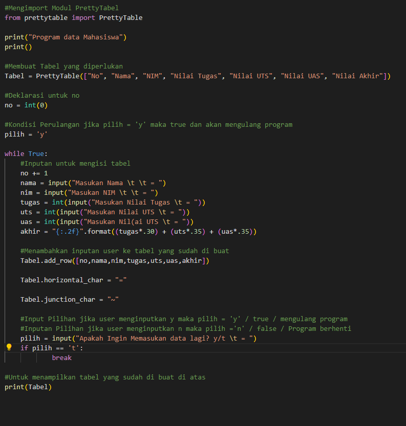<br/>

Berikut hasil output program nya
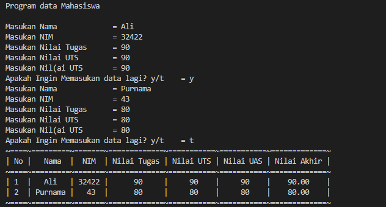

# Program Selesai ☕ 


