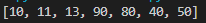

# PRAKTIKUM 5 BELAJAR LIST

## LIST 

### 1 Membuat List

Membuat list dengan simbol list menggunakan [] seperti pada gambar  
Contoh List  
  
Untuk penggunaan list dapat dengan memanggil langsung nama list yang sudah di buat atau memanggil nama list di ikuti dengan index ke berapa yang mau di panggil seperti pada gambar di atas  
Dan ini adalah hasil dari progrma di atas  
  

### 2 Ubah Element List
Mengubah Element pada list  
  
Untuk hasil perubahannnya seperti ini  
  

